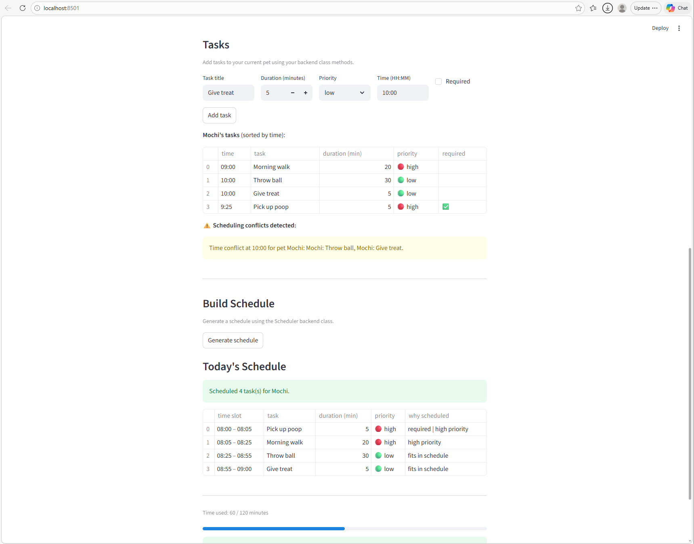

# PawPal+ (Module 2 Project)

You are building **PawPal+**, a Streamlit app that helps a pet owner plan care tasks for their pet.

## Scenario

A busy pet owner needs help staying consistent with pet care. They want an assistant that can:

- Track pet care tasks (walks, feeding, meds, enrichment, grooming, etc.)
- Consider constraints (time available, priority, owner preferences)
- Produce a daily plan and explain why it chose that plan

Your job is to design the system first (UML), then implement the logic in Python, then connect it to the Streamlit UI.

## What you will build

Your final app should:

- Let a user enter basic owner + pet info
- Let a user add/edit tasks (duration + priority at minimum)
- Generate a daily schedule/plan based on constraints and priorities
- Display the plan clearly (and ideally explain the reasoning)
- Include tests for the most important scheduling behaviors

## Getting started

### Setup

```bash
python -m venv .venv
source .venv/bin/activate  # Windows: .venv\Scripts\activate
pip install -r requirements.txt
```

### Suggested workflow

1. Read the scenario carefully and identify requirements and edge cases.
2. Draft a UML diagram (classes, attributes, methods, relationships).
3. Convert UML into Python class stubs (no logic yet).
4. Implement scheduling logic in small increments.
5. Add tests to verify key behaviors.
6. Connect your logic to the Streamlit UI in `app.py`.
7. Refine UML so it matches what you actually built.

---

## Features

### Priority-ranked scheduling
Tasks are sorted into a ranked order before the plan is built: required tasks always go first, then high → medium → low priority. The scheduler uses a greedy algorithm that walks the ranked list and adds each task to the plan only if it fits within the owner's available time — required tasks bypass the time check entirely so they are never dropped.

### Time-slot sorting
`Scheduler.sort_tasks_by_time()` returns any task list sorted into chronological HH:MM order using a stable lambda sort. The Streamlit UI calls this before rendering the task table so a pet owner always sees their day in time order regardless of the order tasks were entered.

### Conflict detection
`Scheduler.detect_time_conflicts()` scans every pet's tasks and groups them by their scheduled time. If two or more tasks share the same HH:MM slot — whether for the same pet or across different pets — it returns a plain-English warning string for each conflict. The UI surfaces each warning as its own `st.warning` banner so nothing gets buried.

### Daily and weekly recurrence
`CareTask` carries a `frequency` field (`"once"`, `"daily"`, or `"weekly"`) and a `due_date`. Calling `CareTask.create_next_occurrence()` returns a fresh task with the due date advanced by 1 day (daily) or 7 days (weekly). `Scheduler.mark_task_complete()` wires this together: it marks the task done and immediately appends the next occurrence to the pet's task list so recurring care is never forgotten.

### Task filtering
`Scheduler.filter_tasks()` accepts an optional completion flag and an optional pet name. It walks all pets on the owner and returns only the tasks that match both filters, making it easy to show "what's still pending for Mochi today" without touching unrelated data.

### Plan validity invariants
`DailyPlan.is_valid_plan()` enforces two correctness rules at any point in time: total scheduled time must not exceed available minutes, and no required task may appear in the skipped list. Both the test suite and the UI rely on this single method as the authoritative correctness check.

---

## Smarter Scheduling

Beyond the core plan generator, `pawpal_system.py` includes several features that make the scheduler more realistic and robust.

### Priority-ranked task selection

Tasks are sorted before scheduling using a two-level key: required tasks are always placed first, then optional tasks are ordered high → medium → low. The greedy selection pass fills available time in that ranked order, so the most critical care always makes it into the plan.

### Task recurrence with `timedelta`

`CareTask` supports a `frequency` field (`"once"`, `"daily"`, `"weekly"`). Calling `Scheduler.mark_task_complete()` on a recurring task automatically creates the next occurrence with a due date calculated using Python's `timedelta`:

- Daily → due date + 1 day
- Weekly → due date + 7 days

This removes the need for the owner to manually re-enter repeating tasks.

### Time-based sorting

`Scheduler.sort_tasks_by_time()` uses a lambda key to sort any list of tasks by their `HH:MM` time string in chronological order — useful for displaying a human-readable day view independent of how tasks were entered.

### Filtering by completion and pet

`Scheduler.filter_tasks()` accepts optional `completed` and `pet_name` arguments and returns only the tasks that match. This makes it easy to show "what still needs to be done today" or "all of Mochi's pending tasks" without modifying the underlying data.

### Conflict detection

`Scheduler.detect_time_conflicts()` scans every task across all pets for shared `HH:MM` start times and returns a list of warning strings — one per conflict. It distinguishes same-pet conflicts from cross-pet conflicts and never raises an exception, leaving the resolution decision to the owner.

### Validated plan output

`DailyPlan.is_valid_plan()` enforces two invariants after scheduling:

- Total scheduled time does not exceed available minutes.
- No required task appears in the skipped list.

This gives both the UI and tests a single method to call for a correctness check.

---

## Testing PawPal+

### Running the tests

All 22 tests should pass. To run the full suite silently:

```bash
python -m pytest
```

### What the tests cover

Tests are organized into six classes in `tests/test_pawpal.py`:

| Class | # Tests | Covers |
|---|---|---|
| `TestTaskCompletion` | 1 | `mark_complete()` flips `completed` from False to True |
| `TestTaskAddition` | 2 | Adding tasks to a pet increases count; all tasks are stored and retrievable |
| `TestRecurringTasks` | 2 | Daily task completion creates next occurrence due tomorrow; weekly creates next due in 7 days |
| `TestSortingByTime` | 4 | Chronological HH:MM ordering; empty list; single task; identical times preserve all entries |
| `TestConflictDetection` | 4 | No conflicts returns `[]`; same-pet conflict warning; cross-pet conflict warning; owner with no pets |
| `TestSchedulingHappyPaths` | 3 | All tasks fit; required task is placed first; plan starts at configured `start_hour` |
| `TestSchedulingEdgeCases` | 6 | Zero tasks; optional tasks skipped when over time limit; required tasks always scheduled even over limit; `once` recurrence returns None; unknown pet name filter returns `[]`; same-named tasks on different pets don't interfere |

The tests also caught a real bug during development: `DailyPlan.add_item()` was incorrectly moving required tasks to `skipped_tasks` when the available time was low. The fix ensures required tasks bypass the time check entirely.

### Confidence level

5 stars

The scheduler's core logic (priority ranking, greedy selection, recurrence, sorting, filtering, and conflict detection) is fully covered by deterministic unit tests passing at 22/22. The star deduction reflects two gaps that remain: the Streamlit UI layer has no automated tests (UI behavior requires manual verification), and the scheduler assumes owners supply feasible required-task sets; if required tasks alone exceed available time, the plan technically becomes invalid but is still generated without a user-facing warning.


## Demo

