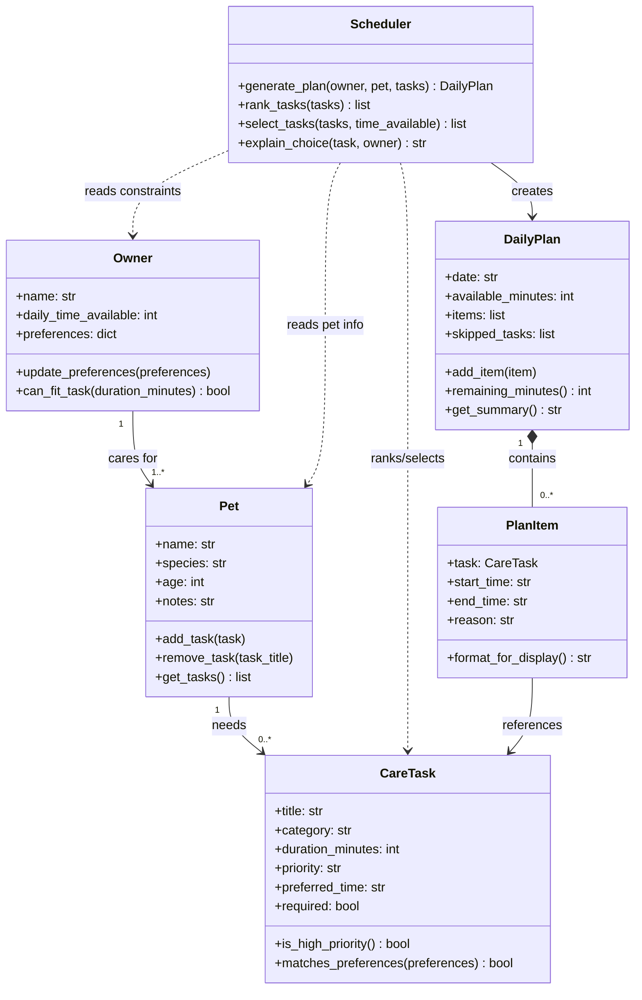

# PawPal+ Project Reflection

## 1. System Design

- A user should be able to enter basic info about themselves and their pet.
- A user should be able to add and edit tasks with duration and priority.
- A user should be able to see a generated plan/schedule and the reasoning behind it.

**a. Initial design**

- My initial UML design focused on keeping the system small and centered on the scheduling problem. I used six main classes: `Owner`, `Pet`, `CareTask`, `Scheduler`, `DailyPlan`, and `PlanItem`.
- The goal was to separate input data from planning logic. `Owner`, `Pet`, and `CareTask` hold the core information entered by the user. `Scheduler` makes decisions based on constraints and priorities. `DailyPlan` represents the result for a single day, and `PlanItem` stores each scheduled task with timing and reasoning.
- I avoided extra classes like separate priority engines, rule objects, or inheritance trees because the project requirements do not justify that complexity yet.

- `Owner`
	Holds the owner's available time and preferences. It only needs behavior related to constraints, not scheduling decisions.

- `Pet`
	Holds basic pet details and the set of tasks associated with that pet. This keeps pet-specific data separate from owner preferences.

- `CareTask`
	Represents one unit of care such as walking, feeding, medication, or grooming. It stores the attributes the README explicitly calls for, especially duration and priority.

- `Scheduler`
	Encapsulates the planning logic. This keeps decision-making in one place instead of scattering it across task or UI code.

- `DailyPlan`
	Stores the output of the scheduling process for one day. It gives the app a clean object to display in the UI and test in unit tests.

- `PlanItem`
	Represents a scheduled task in the final plan, including timing and explanation. I kept this class because the project requires both a plan and reasoning, and mixing that directly into `CareTask` would blur the difference between a task definition and a scheduled result.

**b. Design changes**

- Yes, I made three key changes during the skeleton phase before implementation:

  1. **Added pets collection to Owner.** The UML showed Owner "1" → "1..*" Pet, but the Owner class had no way to hold pets. This would have forced the scheduler to receive owner and pet as separate, disconnected parameters. I added a `pets: list[Pet]` field and methods `add_pet()`, `remove_pet()`, and `get_pets()` to enforce the 1-to-many relationship properly.
  
  2. **Time validation and overflow handling in DailyPlan.** I realized `add_item()` was blindly appending tasks without checking if they fit in remaining time. I updated it to check `remaining_minutes()` and automatically move tasks that don't fit into `skipped_tasks`. This ensures the scheduler never overschedules a day.
  
  3. **Added plan validation method.** I created `is_valid_plan()` to verify two invariants: total scheduled time ≤ available time, and no required tasks are skipped. This gives the scheduler a way to check its own work and the UI a way to ensure the plan is sound before displaying it.

- Without Owner owning its pets, time overflow protection, and plan validation, the scheduler would have had to handle all these concerns itself, duplicating logic and making testing harder. Moving these checks into the data objects makes each class responsible for its own constraints.

---

## 2. Scheduling Logic and Tradeoffs

**a. Constraints and priorities**

- My scheduler considers three constraints:
  1. **Time availability** – All selected tasks must fit within the owner's `daily_time_available` (in minutes).
  2. **Task priority** – Tasks are ranked by priority level: required tasks first, then high/medium/low priority.
  3. **Owner preferences** – Tasks check `matches_preferences()` against owner preferences (e.g., preferred time of day), used in reasoning but not as a hard filter.

- I decided time and priority were non-negotiable because the README explicitly calls for a scheduler that respects constraints and priorities. Owner preferences influence explanation text but don't prevent scheduling. This prioritization keeps the logic simple: the scheduler makes greedy decisions rather than trying to optimize multiple competing goals.

**b. Tradeoffs**

- **Greedy selection over optimization.** My scheduler uses a greedy algorithm: rank tasks by priority, then pack them into available time in order. This is simple, fast, and predictable, but it doesn't optimize globally. For example, if two medium-priority tasks take 50 minutes total, but three low-priority tasks take 45 minutes, the greedy approach picks the medium tasks and skips the low ones. An optimal scheduler might pick the low tasks instead to maximize task count or owner satisfaction.

- **Why this tradeoff is reasonable:** PawPal+ is a personal assistant, not a professional scheduler. The owner benefits from a clear, understandable strategy  more than from perfect global optimization. Greedy selection also keeps the code testable since the ranking is deterministic, and the UI can explain each decision clearly. If requirements change to "maximize task count" or "balance variety," the tradeoff becomes a real problem and we'd revisit it.

---

## 3. AI Collaboration

**a. How you used AI**

- How did you use AI tools during this project (for example: design brainstorming, debugging, refactoring)?
- What kinds of prompts or questions were most helpful?

**b. Judgment and verification**

- Describe one moment where you did not accept an AI suggestion as-is.
- How did you evaluate or verify what the AI suggested?

---

## 4. Testing and Verification

**a. What you tested**

- What behaviors did you test?
- Why were these tests important?

**b. Confidence**

- How confident are you that your scheduler works correctly?
- What edge cases would you test next if you had more time?

---

## 5. Reflection

**a. What went well**

- What part of this project are you most satisfied with?

**b. What you would improve**

- If you had another iteration, what would you improve or redesign?

**c. Key takeaway**

- What is one important thing you learned about designing systems or working with AI on this project?
