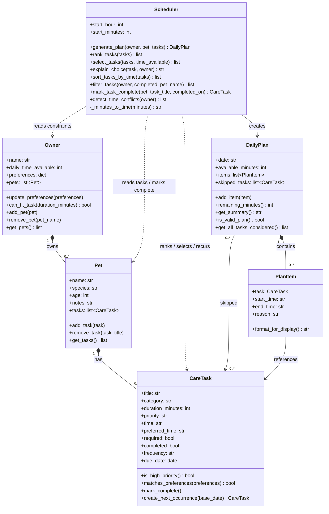

# PawPal+ Final UML Class Diagram

## What changed from the initial diagram

| Class | Changes |
|---|---|
| `Owner` | Added `pets` field (the 1-to-many relationship is now a **composition**, not just an association). Added `add_pet`, `remove_pet`, `get_pets`. |
| `CareTask` | Added `time`, `completed`, `frequency`, `due_date` fields to support scheduling, completion tracking, and recurrence. Added `mark_complete` and `create_next_occurrence`. |
| `Pet` | Added `tasks` field explicitly — the 1-to-many to `CareTask` is now a **composition** inside `Pet`, not just an association arrow. |
| `Scheduler` | Added `start_hour` / `start_minutes` instance fields. Added `sort_tasks_by_time`, `filter_tasks`, `mark_task_complete`, `detect_time_conflicts`, and private `_minutes_to_time`. |
| `DailyPlan` | Added `is_valid_plan` (invariant check) and `get_all_tasks_considered` (scheduled + skipped combined). |
| Relationships | `Owner → Pet` upgraded from association to **composition** (`*--`). `Pet → CareTask` upgraded from association to **composition**. Added explicit `DailyPlan → CareTask` skipped arrow. |
